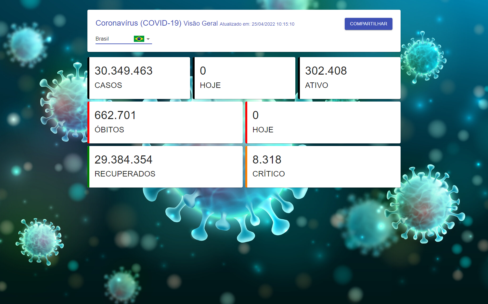

<h2 align="center">PWA com Dados do Covid 19 📊</h2>

    

## 🚀 Tecnologias Utilizadas

O projeto foi desenvolvido utilizando as seguintes tecnologias

- ReactJS
- Styled-Components
- @material-ui/core
- @material-ui/lab
